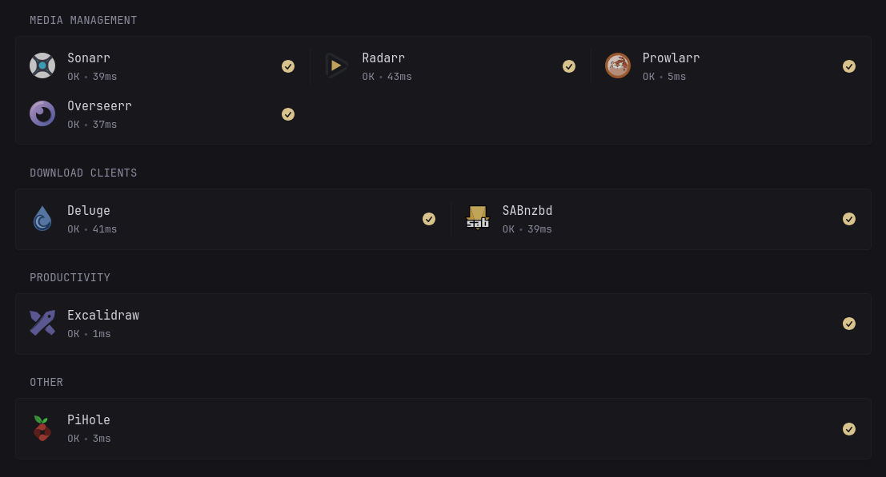
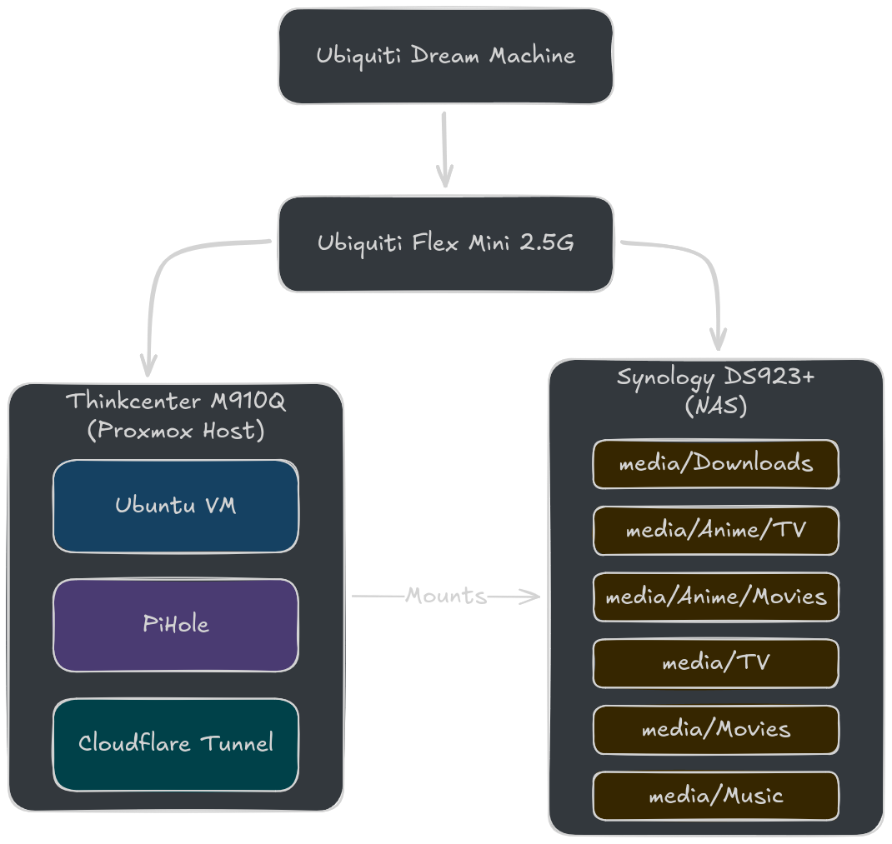

+++
date = '2026-04-06T13:50:54+02:00'
draft = False
title = 'Homelab - Overview'
+++

# Applications Overview
* **Glance** - Simple monitoring and new tab alternative.
* **PiHole** - Network-wide ad blocking
* **Plex** - Media hosting
* **Sonarr/Radarr/Prowlarr/Overseerr** - Media fetching and management
* **Deluge/SABnzbd** - Clients for downloading torrent and Usenet
* **Gluetun** - VPN client
* **Excalidraw** - Diagrams and whiteboarding

# Hardware

* [ThinkCentre M910q Tiny](https://www.lenovo.com/ch/en/p/desktops/thinkcentre/m-series-tiny/thinkcentre-m910q/11tc1mt910q)
* [Synology DS923+](https://www.synology.com/en-us/products/DS923+)
* [Ubiquiti UniFi Dream Machine - Special Edition](https://eu.store.ui.com/eu/en/products/udm-se)
* [Ubiquiti Flex Mini 2.5G](https://eu.store.ui.com/eu/en/products/usw-flex-2-5g-5)

